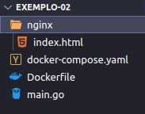

# Docker

Estudo realizado usando como base no vídeo Wesley Willians do canal [**Full Cycle**](https://www.youtube.com/channel/UCMUoZehUZBhLb8XaTc8TQrA) - [**Docker e Docker Compose do zero ao Deploy**](https://www.youtube.com/watch?v=yb2udL9GG2U&ab_channel=FullCycle).

[**Documentação Docker**](https://docs.docker.com/)

## **Docker - Definição:**

Docker é um conjunto de plataforma como produto de serviços que utiliza virtualização a nível de Sistema Operacional para entregar software em pacotes chamados **containers**. Containers são isolados uns dos outros e contém seus próprios softwares, bibliotecas e arquivos de configuração; eles podem se comunicar uns com os outros através de canais bem definidos.

- Wikipedia

## **Containers - Definição:**

Um container é um padrão de unidade de software que empacota o código e todas as dependências de uma aplicação fazendo que a mesma seja executada rapidamente de forma confiável de um ambiente computacional para o outro.

### **Containers vs Máquinas Virtuais**


**CONTAINERS**

Os contêineres são uma abstração na camada de aplicação que embala código e dependências em conjunto. Vários recipientes podem funcionar na mesma máquina e compartilhar o kernel do sistema operacional com outros recipientes, cada um funcionando como processos isolados no espaço do usuário. Os contêineres ocupam menos espaço do que as VMs (as imagens dos contêineres são tipicamente dezenas de MBs de tamanho), podem lidar com mais aplicações e requerem menos VMs e sistemas operacionais.

**VIRTUAL MACHINES**

Máquinas virtuais (VMs) são uma abstração do hardware físico, transformando um servidor em muitos servidores. O hypervisor permite que várias VMs funcionem em uma única máquina. Cada VM inclui uma cópia completa de um sistema operacional, a aplicação, os binários necessários e bibliotecas - ocupando dezenas de GBs. As VMs também podem ser lentas de inicialização.

### Como funcionam os Containers?

**Namespaces**

Os containers utilizam o conceito de namespaces, que coloca o processo em execução em um namespace específico, em que ele e os processos filhos não conseguem acessar nenhum processo ou arquivo fora deste namespace, isso garante um isolamento lógico desse processo.

**Cgroups**

Permite o controle dos recursos do computador, isolando os recursos que um determinando processo pode consumir, além de definir prioridades e poder controlar os processos de um mesmo Cgroups com mais facilidade.

**OFS (Overlay File System)**

Sistema de arquivos que trabalha em camadas, reaproveitando pedaços de códigos de outros containers, economizando consumo de disco.

**Imagens**

As imagens podem ser entendidas como a planta de uma casa, ou seja, um template feito para que possamos executar nosso container, ou construir nossa casa.

Uma imagem “limpa” é chamado de **Scratch**.

**Dockerfile**

Arquivo de configurações que utiliza linguagem declarativa para definir a construção da sua imagem.

Exemplos

```bash
# define a partir de qual exemplo de imagem você deseja criar a sua
FROM: ImageName

# comandos que serão executados
RUN: apt-get install

# define porta que será exposta para comunicação
EXPOSE: 8000
```

Quando criamos imagens, estamos criando processos. É importante entender que imagens tem estados imutáveis, ou seja, não podem ser alteradas. Além disso, uma camada de leitura e escrita nas imagens, que permitem manipular arquivos, porém ao derrubar essa imagem e levantar novamente, esses arquivos serão perdidos.


### Arquitetura do Docker


O Docker utiliza uma arquitetura cliente-servidor. O Docker *cliente* fala com o Docker *daemon*, que faz o levantamento pesado do prédio, a execução e a distribuição de seus containers Docker. O cliente Docker e o daemon *can* funcionam no mesmo sistema, ou você pode conectar um cliente Docker a um daemon Docker remoto. O cliente Docker e o daemon se comunicam usando uma API REST, sobre soquetes UNIX ou uma interface de rede. Outro cliente Docker é o Docker Compose, que permite trabalhar com aplicações que consistem em um conjunto de containers.

O docker host tem também um cache, que evita uso de banda desnecessário ao baixar imagens que já foram previamente baixadas. Outro recurso importante, é o gerenciamento de volumes que ele realiza, que pode montar um volume local da máquina em um container, além de um recurso de gerenciamento de networks.


### Docker - Comandos

[**Instalação**](https://docs.docker.com/get-docker/)

[**Docker Hub - Repositório de Imagens**](http://hub.docker.com)

- **Docker run <IMAGE>**
  
    Cria um container a partir de uma imagem.

    Cria e executa container a partir da imagem de exemplo do docker, com uma mensagem auto explicativa sobre o passo-a-passo para execução.

  ```bash
  docker run hello-world
  ```

    Cria e executa um container a partir de uma imagem do ubuntu e executa o bash

  ```bash
  docker run ubuntu /bin/bash
  ```

    Cria e executa um container do servidor nginx e redireciona toda requisição na porta **8080** do computador host para a porta **80** do container

  ```bash
  docker run -p 8080:80 nginx
  ```

    Quando executamos o docker run de forma normal, o processo em execução fica “preso” ao nosso terminal, para evitar isso devemos executar o comando em modo detached, ou seja, desvinculado do nosso terminal, basta utilizar o parâmetro ***-d***

  ```bash
  docker run -d -p 8080:80 nginx
  ```

    O parâmetro ***—name*** nos permite atribuir um nome a um container.

  ```bash
  docker run --name nginx -d -p 8080:80 nginx
  ```

- **docker ps**
  
    Lista as imagens em execução
  
    Exemplo
  
  ```bash
  # comando simples
  docker ps
  
  # passando o parâmetro -a listamos todas as imagens, inclusive as paradas
  docker ps -a
  ```

- **docker stop <CONTAINER ID ou CONTAINER NAME>**
  
    Para a execução de um container, recebe como parâmetro o ID de um container ou seu nome.
  
    Exemplo
  
  ```bash
  docker stop 6485b810d1a0
  ```

- **docker rm <CONTAINER ID ou CONTAINER NAME>**
  
    Remove um container.
  
  ```bash
  docker rm 6485b810d1a0
  ```

- **docker start <CONTAINER ID ou CONTAINER NAME>**
  
    Inicia um container já existente, que estava em estado de stop.
  
  ```bash
  docker rm 6485b810d1a0
  ```

- **docker exec <CONTAINER> <COMMAND>**
  
    Executa comandos em containers que estão em execução.
  
  ```bash
  # executa um comando diretamente no container e retorna a saída no terminal
  docker exec nginx ls
  
  # passando o parâmetro ***-it*** você acessa diretamente o terminal do container
  docker exec -it nginx bash
  ```

- **docker images**
  
    Lista todas as imagens no computador
  
  ```bash
  docker images
  ```

- **docker rmi <CONTAINER>**
  
    Remove uma imagem do computador, caso um ***docker run*** seja chamado a imagem deverá ser baixada novamente.
  
  ```bash
  docker rmi nginx
  ```

- **docker push <IMAGEM>**
  
    Através deste comando conseguimos fazer o push da nossa imagem no Docker Hub, para que qualquer pessoa possa acessar e baixar
  
  ```bash
  docker push nome-da-imagem
  ```

### Arquivos de configuração - Dockerfiles

Os arquivos de configuração recebem definições para gerar uma imagem.

## Exemplo 01

**Em nosso exemplo, implementamos um servidor simples que apenas recebe uma requisição http e devolve uma frase na tela, desenvolvido em linguagem Go:**

*main.go*

```go
package main

import {
    "fmt"
    "log"
    "net/http"
}

func handler(w http.ResponseWriter, r *http.Request) {
    fmt.Fprintf(w, "Hello World, Docker!")
}

func main() {
    http.HandleFunc("/", handler)
    log.Fatal(http.ListenAndServe(":8080, nill))
}
```

**Depois, criamos o arquivo Dockerfile:**

*Dockerfile*

```bash
# Definição para usar a imagem golang versão 1.14 como base
FROM golang:1.14

# Copia todos os arquivos do diretório do Dockerfile e irá colar dentro da imagem gerada
COPY . .

# Gera o executável do arquivo go
RUN go build main.go

# Expoe a porta 8080 para comunicação com outros containers
EXPOSE 8080

# Define que ao iniciar container será executado o arquivo main.go gerado pelo comando RUM
ENTRYPOINT ["./main"]
```

Para criarmos nossa imagem, precisamos executar o seguinte comando:

```bash
# o parâmetro *-t indica a tag (nome) da nossa imagem, seguido pelo nome e pelo caminho do arquivo Dockerfile*
docker build -t estudodocker/exemplo-01 .
```

Após isso, utilizamos o próximo comando para “subir” nosso container, que poderá ser acessado utilizando o link *localhost:8080*

```bash
# Executa nosso container e executa requisições na porta 8080 do nosso computador para porta 8080 do container
docker run -p 8080:8080 estudodocker/exemplo-01
```

## Exemplo 02

Quando precisamos gerenciar diversos containers que precisam ser executados em conjunto, os comandos tendem a ficar mais complexos, para isso, utilizamos uma ferramenta chamada [Docker Compose](https://docs.docker.com/compose/), que nos ajuda nessa tarefa.

Usaremos os mesmos arquivos que criamos no exemplo anterior, mas criaremos uma pasta chamada *nginx* e nessa pasta um arquivo de nome *index.html* com o seguinte conteúdo:


*nginx/index.html*

```html
<!DOCTYPE html>
<html lang="en">
<head>
    <meta charset="UTF-8">
    <meta http-equiv="X-UA-Compatible" content="IE=edge">
    <meta name="viewport" content="width=device-width, initial-scale=1.0">
    <title>Docker estudo</title>
</head>
<body>
    <h1>Hello world, from nginx</h1>
</body>
</html>
```

Depois, criaremos um arquivo chamado ***docker-compose.yaml*** com o seguinte conteúdo:

./*docker-compose.yaml*

```yaml
# define a versão do nosso compose
version: '3'

# define os serviços que iremos sar
services:

  # cria um container com um serviço chamado 
  webservergo:
    # executa nosso docker file no caminho .
    build: .
    # redireciona a porta 8081 do host para porta 8080 do container
    ports:
      - 8081:8080

  # cria um container com um serviço chamado nginx
  nginx:
    # usa como imagem base a imagem do nginx  
    image: nginx
    # compartilha o volume ./nginx do host no endereço /usr/share/nginx/html do container
    volumes: 
      - ./nginx:/usr/share/nginx/html
    # redireciona a porta 8080 do host para a porta 80 do container
    ports:
      - 8080:80

  # cria container com um serviço chamado redis 
  redis:
    # usa como base a imagem do redis alpine
    image: redis:alpine
    # expoe a porta 6379 para que outros containers possam acessar
    expose: 
      - 6379

```

Assim ficou a estrutura de nossa pasta:

*/nginx*

*|—index.html*

*docker-compose.yaml*

*Dockerfile*

*main.go*



Após a configuração, utilizaremos o comando ***docker-compose up*** para subirmos nosso container

```bash
# sobe o container
docker-compose up

# executa o processo desvinculado do terminal (detached)
docker-compose up -d
```

Cada container poderá ser acessado através das portas especificadas no arquivo *docker-compose.yaml.*
